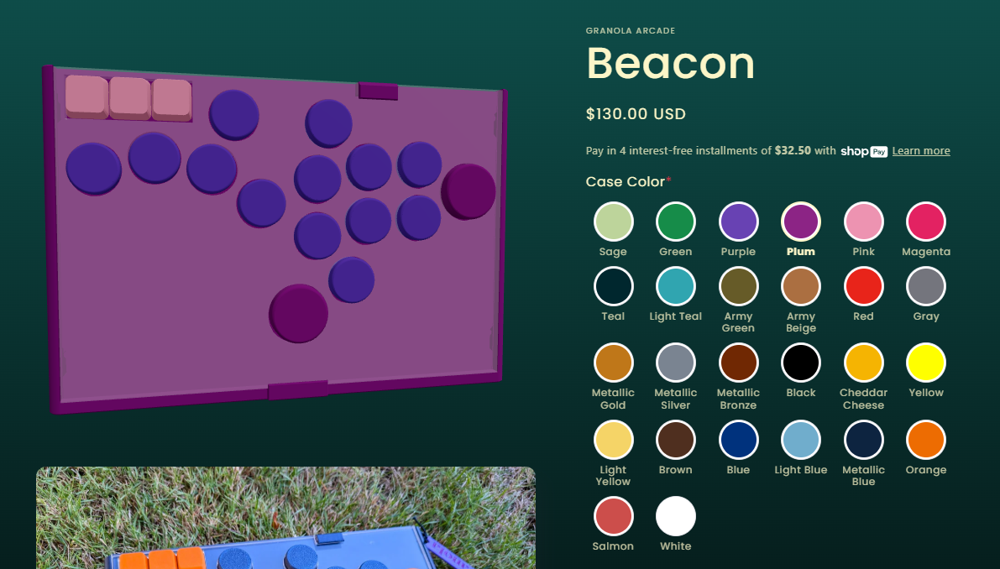

# Granola 3D Configurator

A React + Three.js product viewer for [Granola](https://granola.games) controllers. Displays a 3D model that updates colors in real-time based on Shopify product customization selections. Supports multiple products from a single deployment.



## Setup

```bash
npm install
cp .env.example .env
# Set model URLs for each product (e.g. /beacon.gltf, /plateau.gltf)
npm run dev
```

Place your GLTF model files in `public/`.

## Multi-Product Support

Products are selected via URL parameter: `?product=beacon` (default) or `?product=plateau`.

Each product config in `src/products.jsx` defines:
- Model URL, camera position, and FOV
- Color state keys and default colors
- Shopify field ID mapping
- GLTF mesh grouping rules (parent prefix map)
- Optional acrylic and logo settings

## Preparing a GLTF Model

The viewer maps color groups to parts of the 3D model by matching node names in the GLTF hierarchy. When preparing your model:

1. **Organize your assembly** — Group parts that should share a color together. You can either:
   - **Name parts directly** (e.g. `Case_Top`, `Buttons_24mm`) if each colorable group uses unique geometry
   - **Use subassemblies** (e.g. a `Directions_Buttons` subassembly containing multiple instances of `Buttons_24mm`) when parts share the same geometry but belong to different color groups

2. **Choose meaningful names** — The viewer walks up the node hierarchy looking for names that match the prefixes in your product config's `parentPrefixMap`. For example, a mesh inside a subassembly named `Directions_Buttons` will match the prefix `Directions_Buttons` regardless of nesting depth.

3. **Export as GLTF/GLB** — Use your CAD or 3D modeling tool's GLTF exporter. Most tools (Blender, Onshape, Fusion 360, etc.) support GLTF export. Ensure node names are preserved during export — some exporters may append suffixes like ` <1>` which the viewer strips automatically.

4. **Place the file** — Drop the exported `.gltf` or `.glb` file into the `public/` directory.

5. **Add the product config** — Add an entry to `src/products.jsx` with a `parentPrefixMap` that maps your assembly node names to color state keys.

## How It Works

- **3D Viewer** — Built with `@react-three/fiber` and `@react-three/drei`. Loads a GLTF model and maps meshes to configurable color groups by walking the ancestor node hierarchy to match named parent prefixes.
- **Shopify Bridge** — Communicates with the Shopify product page via `postMessage`. The viewer listens for `SET_COLOR` and `SET_ALL_COLORS` messages and posts `VIEWER_READY` when loaded. Separate bridge scripts handle different input types (radio buttons vs dropdowns).
- **Embedding** — Deploy to Vercel and embed as an iframe on the Shopify product page.

## Deployment (Vercel)

1. Connect the repo to a Vercel project
2. Add environment variables in Vercel project settings:
   - `VITE_BEACON_MODEL_URL` — path to Beacon GLTF (e.g. `/beacon.gltf`)
   - `VITE_PLATEAU_MODEL_URL` — path to Plateau GLTF (e.g. `/plateau.gltf`)
   - `VITE_MODEL_URL` — legacy fallback for Beacon
3. Deploy — `vercel.json` configures CORS and CSP headers for embedding
4. Embed on Shopify product pages (see below)

## Shopify Embed

Each product needs an iframe and its corresponding bridge script on the Shopify product page.

```html
<!-- Product viewer iframe -->
<iframe
  id="your-product-viewer"
  src="https://your-app.vercel.app/?product=your-product"
  style="width: 100%; height: 500px; border: none;"
  loading="lazy"
  allow="fullscreen"
  allowtransparency="true"
></iframe>

<!-- Bridge script (handles customizer widget → iframe communication) -->
<script src="https://your-app.vercel.app/shopify-bridge-your-product.js" defer></script>
```

The iframe `id` must match the `IFRAME_ID` in the corresponding bridge script.

## Testing Colors

With the dev server running, paste in the browser console:

```js
// Change a color by field ID
window.postMessage({ type: 'SET_COLOR', fieldId: 313063, colorName: 'Green' }, '*')
```

## License

MIT
